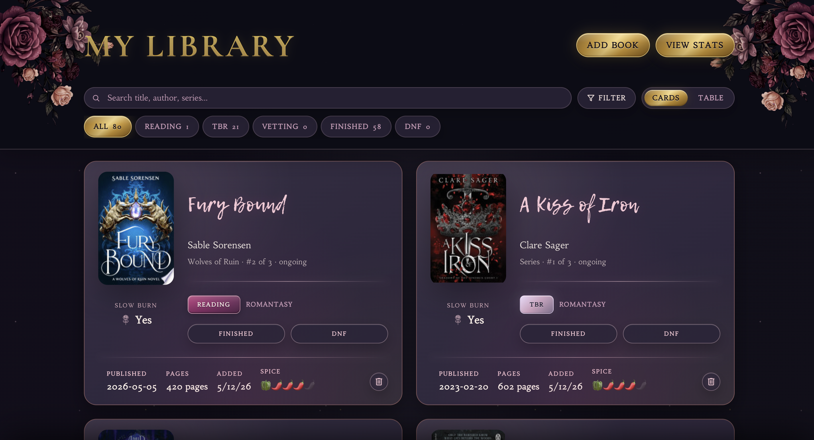
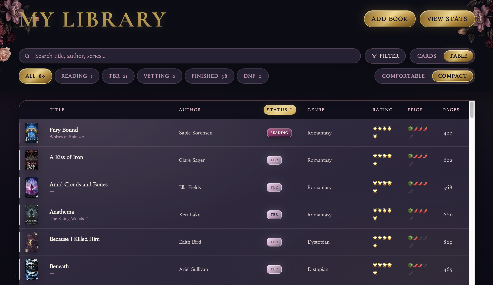
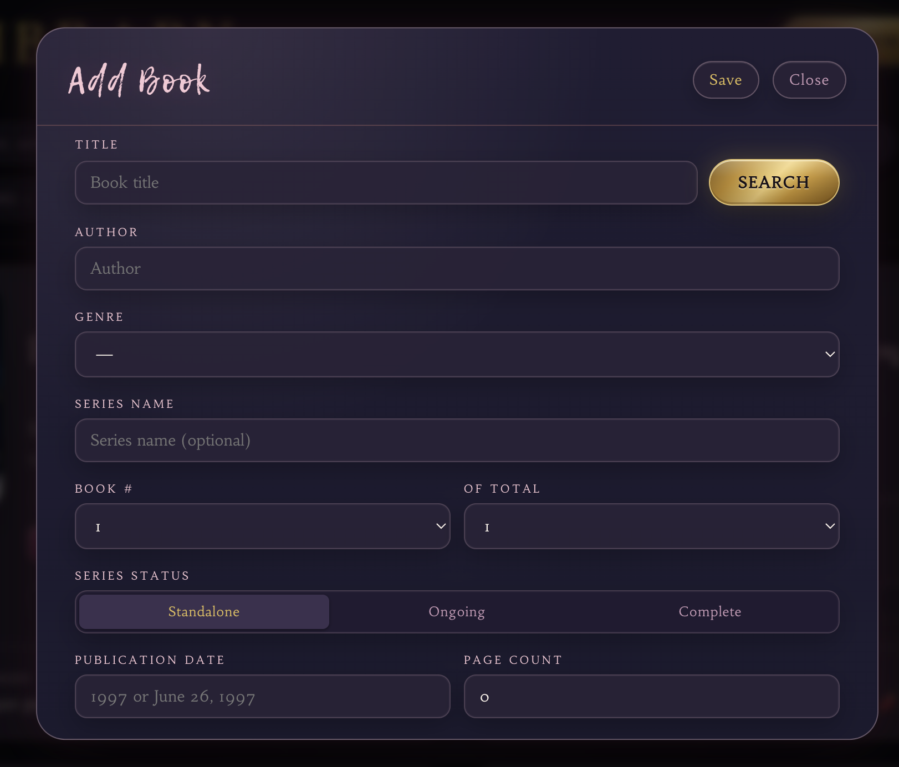
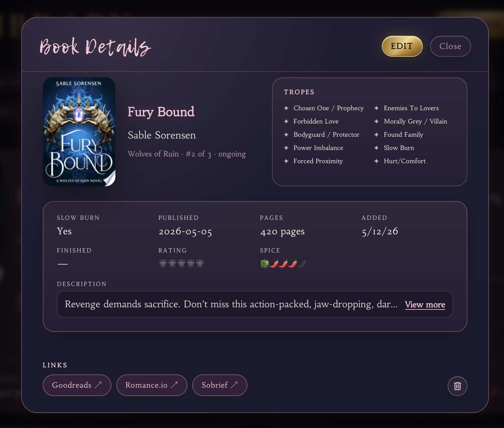
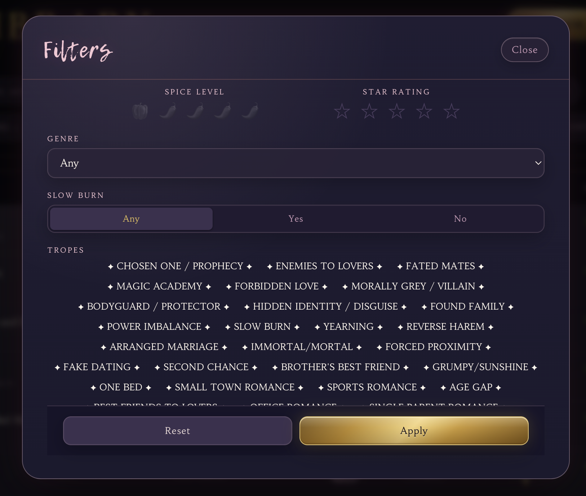

# Cozy Book Tracker

A personal reading tracker I built to make organizing books feel more immersive, visual, and enjoyable.

A lot of book tracking tools felt cluttered or too utility-focused for the way I personally like to browse and collect books. I wanted something that felt cozy and aesthetic while still being fast, information-dense, and useful for managing a large reading list.

This project became a mix of product design exploration, API experimentation, interface design, and AI-assisted rapid prototyping.

---

## The Problem

Most reading trackers either focus heavily on raw data or feel visually outdated. I wanted to create a system that balanced strong visual design with practical organization while reducing friction when adding and managing books.

I also wanted to explore how API integrations and smart autofill behaviors could make tracking books feel significantly faster and easier.

---

## What I Designed

The tracker includes:

- Library management and reading organization
- Card and table-based browsing views
- Filtering and sorting systems
- Detailed book pages
- Faster add-book workflows
- Reading progress tracking
- Cozy visual styling inspired by modern gaming and collector interfaces
- Mobile-friendly responsive layouts

---

## Smart Features and API Work

A major focus of the project was reducing friction when adding books manually.

The app uses book search APIs to quickly pull book information directly into the tracker. I also experimented with using titles and descriptions to automatically fill supporting categories and metadata to speed up organization and reduce repetitive input.

I also built automatic link generation for Goodreads, Romance.io, and SoBrief so users could quickly jump to external references and reviews directly from the stored book information.

This part of the project was especially focused on workflow efficiency and practical UX improvements for heavy readers managing large libraries.

---

## My Role

I handled the full product direction, UX thinking, visual design, interaction design, prototyping, branding, and front-end implementation.

I also used AI-assisted workflows heavily throughout the project for ideation, interface exploration, prototyping, debugging, and rapid iteration.

---

## Tools Used

- HTML, CSS, React, and JavaScript for the code  
- Vercel v0 for early prototyping and layout exploration  
- ChatGPT and Claude for iteration, debugging, and workflow experimentation  
- VS Code for manual code editing and refinement  
- External APIs for book search and metadata retrieval  
- Figma and Adobe tools for visual design exploration  

---

## Screenshots

### Home Screen/Detailed Card View

### Compact Table View - Uses Expanded or Compact, Sortable

### Add Book Flow with Auto-Fill and Google Books API

### Book Detail Popup View

### Filters - Including Tropes Pulled from Descriptions

---

## What I Learned

This project helped me think more deeply about information-heavy interfaces and how visual hierarchy affects usability when users are managing large collections of data.

It also gave me more experience working with APIs, autofill logic, responsive layouts, filtering systems, and AI-assisted rapid prototyping workflows.

A major goal throughout the project was balancing functionality with emotional design so the product still felt warm and enjoyable instead of overly technical.

---

## What I’d Improve Next

- More advanced recommendation systems
- Better analytics and reading insights
- Expanded tagging and custom collections
- Accessibility improvements
- Native mobile app support
- Social and shared reading features
